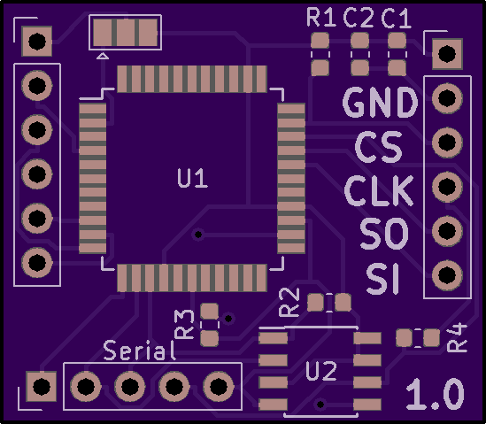
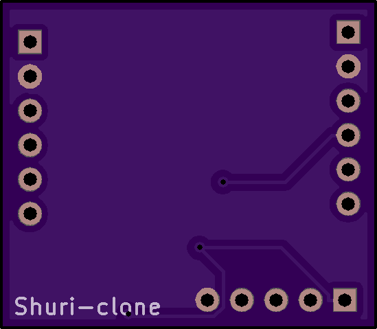

# Shuri-Clone
A clone of the [shuriken_attack](http://retro-system.com/shuriken_attack.htm)

[Purchase on OSHPARK](https://oshpark.com/shared_projects/V40LT2Li)

Images
================

BOM
================
| Reference  | Description |
| ------------- | ------------- |
| U1 | XC9572XL-10VQG44C |
| U2 | M25P40-VMN3TPB |
| R1 | 10K 0603 |
| R2 | 10K 0603 |
| R3 | 10K 0603 |
| R4 | 470 0603 |
| C1 | 0.1uF |
| C2 | 1uF |

Flashing
================
- Download [Cypress USB Suite](http://dlm.cypress.com.edgesuite.net/akdlm/downloadmanager/documents/CySuiteUSB_3_4_7_B204.exe) and then install it
- Download [AN58764_with_spi.zip](AN58764_with_spi.zip) and extract it somewhere (Original download can be found on http://retro-system.com/shuriken_attack.htm)
- Download [gcos_1_5_tmbinc.bin](gcos_1_5_tmbinc.bin) Original download can be found on http://retro-system.com/shuriken_attack.htm

- Plug in the CY7C68013A and start CyConsole
- Click options and then EZ-USB Interface
- Click download and then select VirtualCom.hex in the AN58764 folder you extracted earlier
- Open device manager and make sure you know what COM port the device is now listed as
- Run "new_fpga_flash COM# gcos_1_5_tmbinc.bin" in comman prompt (replace # with whatever number your com port is in device manager)